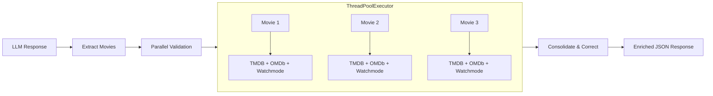

# LLM Hallucination Validation Guide

## Overview

The hallucination validation system provides automatic verification of LLM-generated movie recommendations against authoritative sources (TMDB and OMDb APIs). This ensures that all movie recommendations presented to users are real, accurate, and verifiable.

## How It Works

### Validation Pipeline



### Validation Steps

1. **Extract Movies**: Parse JSON manifest from LLM response
2. **Normalize Data**: Clean title, year, and director for accurate matching
3. **Multi-Source Lookup**: Query both TMDB and OMDb APIs
4. **Calculate Confidence**: Determine match quality and confidence score
5. **Apply Corrections**: Fix minor discrepancies (typos, wrong years)
6. **Filter Results**: Drop movies that can't be verified
7. **User Notification**: Transparently report corrections and drops

## Validation Confidence Levels

| Confidence | Interpretation | Action |
|-----------|----------------|--------|
| 0.9 - 1.0 | **High**: Both sources confirm, exact or very close match | ✅ Keep |
| 0.7 - 0.9 | **Good**: Strong match from one source, partial from other | ✅ Keep |
| 0.5 - 0.7 | **Medium**: Single source validation (obscure titles) | ✅ Keep |
| < 0.5     | **Low**: Not found or significant discrepancies | ❌ Drop |

## Features

### 1. Typo Tolerance

The system can handle minor spelling errors:

```python
LLM Output: "The Shawshank Redemtion" 
Validated:  "The Shawshank Redemption" ✓
```

**Detection Method**: Character-level similarity with edit distance approximation

### 2. Auto-Correction

Automatically corrects verified discrepancies:

- **Title**: Corrects typos and variations
- **Year**: Updates to canonical release year
- **Director**: Normalizes director names

### 3. Graceful Degradation

For obscure or rare movies:

- Accepts single-source validation (TMDB or OMDb)
- Lower confidence score but still valid
- Useful for art films, foreign cinema, indie productions

### 4. Transparent Feedback

Users are notified when:

```
Note: 1 recommendation(s) were filtered out because they could not be 
verified in movie databases: The Fake Movie. This helps ensure all 
recommendations are real, accurate movies.

Note: 2 movie detail(s) were automatically corrected to match official 
database records.
```

## API Integration

### In Flask App (`cineman/app.py`)

```python
from cineman.validation import validate_movie_list

# After LLM generates response
validated_response, movie_titles, summary = extract_and_validate_movies(
    llm_response, 
    session_id
)

# summary contains:
# - total_checked: Number of movies validated
# - valid_count: Movies that passed validation
# - dropped_count: Movies filtered out
# - avg_latency_ms: Average validation time
```

### Direct Validation

```python
from cineman.validation import validate_llm_recommendation

result = validate_llm_recommendation(
    title="Inception",
    year="2010",
    director="Christopher Nolan",
    recommendation_id="session_123_m1"
)

# result.is_valid: True/False
# result.confidence: 0.0 to 1.0
# result.corrections: Dict of corrected fields
# result.should_drop: Whether to filter out
```

## Performance

### Latency Targets

- **Average validation time**: < 400ms per movie
- **With caching**: < 100ms per movie (subsequent requests)

### Caching Strategy

- OMDb responses cached for 5 minutes (300 seconds)
- TMDB responses not cached (fast API)
- Cache key: Normalized title (case-insensitive)

### Optimization Tips

1. **Batch Validation**: Use `validate_movie_list()` for multiple movies.
2. **Cache Warming**: Pre-populate cache for popular movies.
3. **9-Way Parallelization**: APIs (TMDB, OMDb, Watchmode) are called concurrently for all movies in the list using `ThreadPoolExecutor`. This reduces total validation wall-time to the duration of the single slowest API call.

## Logging

Validation events are logged for debugging and monitoring:

```python
import logging
logging.getLogger('cineman.validation').setLevel(logging.INFO)
```

### Log Levels

- **INFO**: Validation attempts and results
- **WARNING**: Dropped recommendations
- **ERROR**: API errors or unexpected failures

### Example Log Output

```
INFO [Validation session_123_m1] Validating: 'Inception' (2010) by Christopher Nolan
INFO [Validation session_123_m1] Result: valid=True, confidence=0.95, source=both, latency=250.3ms
INFO [Validation session_123_m2] Corrections needed: {'year': ('2011', '2010')}
WARNING [Validation session_123_m3] Recommendation should be dropped: Movie 'Fake Movie' not found in TMDB or OMDb databases.
```

## Testing

### Unit Tests

```bash
# Run all validation tests
python -m pytest tests/test_validation.py -v

# Run integration tests
python -m pytest tests/test_validation_integration.py -v

# Run with real APIs (requires API keys)
python -m pytest tests/test_validation.py -v -m integration
```

### Test Coverage

- ✅ Normalization (7 tests)
- ✅ Title similarity (5 tests)  
- ✅ Validation logic (6 tests)
- ✅ Batch validation (2 tests)
- ✅ Integration with app (5 tests)
- ✅ Performance benchmarks (1 test)

### Example Test Cases

1. **Real Movies**: Should validate with high confidence
2. **Hallucinated Movies**: Should be dropped
3. **Typos**: Should be corrected and validated
4. **Obscure Movies**: Should validate with single source
5. **Wrong Metadata**: Should correct year/director

## Configuration

### Environment Variables

```bash
# Required for validation
export TMDB_API_KEY=your_tmdb_key
export OMDB_API_KEY=your_omdb_key

# Optional - OMDb cache TTL (seconds)
export OMDB_CACHE_TTL=300

# Optional - Disable validation (not recommended)
export VALIDATION_ENABLED=1  # Set to 0 to disable
```

### Validation Settings

Located in `cineman/validation.py`:

```python
# Confidence thresholds
VALIDATION_THRESHOLD = 0.5        # Minimum to keep
SINGLE_SOURCE_PENALTY = 0.8       # Reduce confidence for single source
TYPO_SIMILARITY_THRESHOLD = 0.8   # Character similarity for typo detection

# Performance
DEFAULT_TIMEOUT = 6               # API timeout in seconds
MAX_RETRIES = 2                   # Retry count for transient errors
```

## Troubleshooting

### Common Issues

#### 1. All Movies Being Dropped

**Symptom**: Every recommendation is filtered out

**Causes**:
- API keys not set or invalid
- Network connectivity issues
- API rate limits exceeded

**Solutions**:
- Verify `TMDB_API_KEY` and `OMDB_API_KEY` are set
- Check API status: `curl https://api.themoviedb.org/3/configuration?api_key=YOUR_KEY`
- Review logs for error messages

#### 2. Legitimate Movies Being Dropped

**Symptom**: Real but obscure movies are filtered

**Causes**:
- Very new releases not yet in databases
- Foreign films with translation issues
- Extremely obscure indie films

**Solutions**:
- Lower confidence threshold (not recommended)
- Whitelist specific titles
- Wait for database updates

#### 3. High Latency

**Symptom**: Validation takes > 400ms average

**Causes**:
- Cold cache (first requests)
- Network latency
- API slowness

**Solutions**:
- Pre-warm cache for popular movies
- Increase cache TTL
- Check network connection
- Use async validation (future enhancement)

## Best Practices

### For Developers

1. **Always validate**: Never disable validation in production
2. **Monitor metrics**: Track dropped_count and avg_latency
3. **Review logs**: Check for patterns in dropped movies
4. **Test edge cases**: Verify typo handling and obscure titles
5. **Update regularly**: Keep API client libraries current

### For Users

Users automatically benefit from validation with:

- ✅ Verified movie recommendations
- ✅ Transparent corrections
- ✅ Clear notes about filtered content
- ✅ Improved trust in recommendations

## Future Enhancements

Potential improvements:

1. **Async Validation**: Non-blocking API calls
2. **Fuzzy Matching**: More sophisticated similarity algorithms
3. **Director Validation**: Cross-check director names
4. **User Feedback**: Allow users to report false positives
5. **Confidence Tuning**: ML-based confidence scoring
6. **Multi-Language**: Support for non-English titles
7. **Streaming Data**: Real- [x] Streaming availability data (Integrated via Watchmode)checking

## Related Documentation

- [API Keys Setup](../wiki/API-Keys.md)
- [Architecture Overview](../wiki/Architecture.md)
- [Validation Pipeline](VALIDATION_GUIDE.md)
- [Schema Guide](SCHEMA_GUIDE.md#streaming-data)
- [Testing Guide](../README.md#testing-individual-components)

## Support

For issues or questions:

1. Check logs: `logging.getLogger('cineman.validation')`
2. Review test cases: `tests/test_validation*.py`
3. Check API status: `/api/status` endpoint
4. File an issue: GitHub Issues

---

**Last Updated**: 2025-01-22
**Module**: `cineman/validation.py`
**Tests**: `tests/test_validation*.py`
